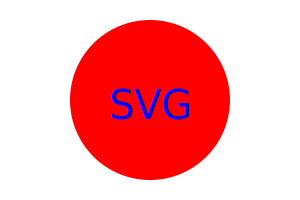

### SVG Logo Generator

## User Story
```markdown
AS a freelance web developer
I WANT to generate a simple logo for my projects
SO THAT I don't have to pay a graphic designer
```

## Acceptance Criteria
```markdown
GIVEN a command-line application that accepts user input
WHEN I am prompted for text
THEN I can enter up to three characters
WHEN I am prompted for the text color
THEN I can enter a color keyword (OR a hexadecimal number)
WHEN I am prompted for a shape
THEN I am presented with a list of shapes to choose from: circle, triangle, and square
WHEN I am prompted for the shape's color
THEN I can enter a color keyword (OR a hexadecimal number)
WHEN I have entered input for all the prompts
THEN an SVG file is created named `logo.svg`
AND the output text "Generated logo.svg" is printed in the command line
WHEN I open the `logo.svg` file in a browser
THEN I am shown a 300x200 pixel image that matches the criteria I entered
```

## Description
The SVG Logo Generator is a command-line tool that helps users create simple SVG (Scalable Vector Graphics) logos. Users can select different shapes and colors to customize their logos with up to three characters. The generated logo is saved as an SVG file named `logo.svg`.

## Features
- Select a shape from three options: Circle, Triangle, Square
- Choose colors for the text and shape using either CSS color keywords or hex codes
- Input up to three characters to be displayed in the center of the shape
- Output a customized SVG file

## Installation
1. Clone the repository or download the project files:
    ```sh
    git clone <repository-url>
    cd svg-logo-generator
    ```

2. Install the necessary dependencies:
    ```sh
    npm install
    ```

## Usage
To generate an SVG logo, run the command:
```sh
node index.js
```

You will be prompted to enter:
1. Text (up to 3 characters)
2. Text color (CSS color keyword or hex code)
3. Shape (circle, triangle, or square)
4. Shape color (CSS color keyword or hex code)

The generated logo will be saved as `logo.svg` in the current directory.

## Examples
Here are some examples of generated logos:

### Triangle


### Circle


### Square


In the command line, it will look like this:
```sh
node index.js
Enter up to three characters: SVG
Enter text color (keyword or hex code): Red
Choose a shape: circle
Enter shape color (keyword or hex code): Blue
Generated logo.svg
```

## Contributing
Pull requests and issues are welcome. For major changes, please open an issue first to discuss what you would like to change.

## License
[MIT](https://choosealicense.com/licenses/mit/)

## Contact
If you have any questions or feedback, please reach out to me at [GitHub](https://github.com/BenJR546) or by [Email](mailto:benjrice546@gmail.com).